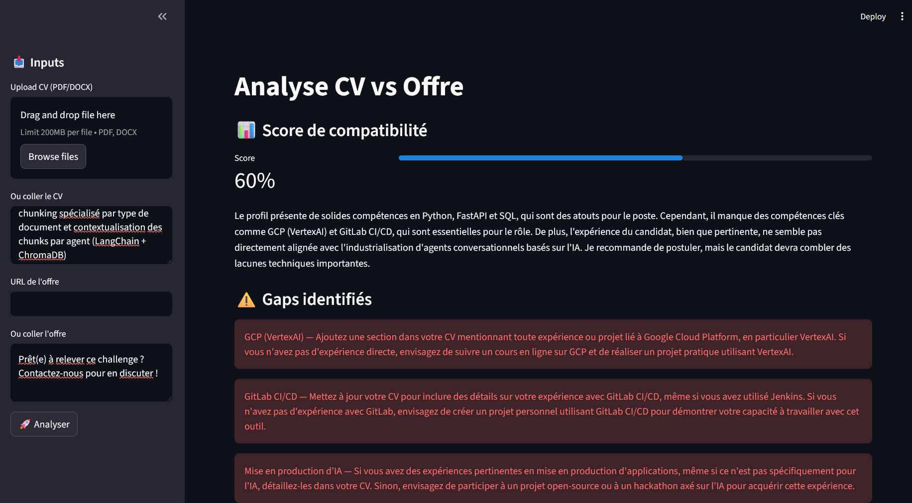

# 🎯 CV Job Matcher

Un système d'analyse de compatibilité entre un CV et une offre d'emploi, piloté par **5 agents LLM spécialisés** s'exécutant en parallèle. L'interface Streamlit permet de soumettre un CV (PDF, DOCX ou texte) et une offre (URL ou texte collé) pour obtenir une analyse structurée et actionnnable en quelques secondes.

> *Développé dans le cadre d'une montée en compétences en AI Engineering — et utilisé activement pour mes propres candidatures.*

---

## 🎬 Démonstration



---

## 🎯 Problématique

Les outils de matching CV/offre existants se limitent généralement à de la correspondance par mots-clés. Ce projet va plus loin : chaque dimension de l'analyse est déléguée à un agent spécialisé qui raisonne sur le contenu, pas sur des fréquences de termes. Le résultat est une analyse qualitative, actionnnable, et adaptée à la langue de l'offre.

---

## 🏗️ Architecture

```
CV (PDF / DOCX / texte)  +  Offre (URL / texte)
                │
                ▼
        ┌──────────────────┐
        │ CurriculumLoader │  extraction PDF, DOCX, texte brut
        │ JobLoader        │  scraping URL ou texte direct
        └───────┬──────────┘
                │
                ▼
        ┌────────────────┐
        │ ExtractorAgent │  parse CV + offre → représentation structurée partagée
        └───────┬────────┘
                │
                ▼ (ThreadPoolExecutor — 5 agents en parallèle)
    ┌───────────┬───────────┬──────────────┬───────────────┐
    │           │           │              │               │
ScoreAgent  GapsAgent  KeywordsAgent  StrengthsAgent  RewordingAgent
    │           │           │              │               │
    └───────────┴───────────┴──────────────┴───────────────┘
                                │
                                ▼
                        Interface Streamlit
```

### Principe clé — Agent d'extraction comme couche intermédiaire

Plutôt que de passer les textes bruts à chaque agent, un `ExtractorAgent` parse les deux documents une fois et produit une représentation structurée partagée (validée par Pydantic). Les agents d'analyse reçoivent uniquement cette représentation — ce qui réduit la consommation de tokens, améliore la fiabilité des outputs, et rend chaque agent indépendant et testable isolément.

### Parallélisation

Les 5 agents d'analyse sont indépendants une fois l'extraction terminée. Ils s'exécutent simultanément via `ThreadPoolExecutor(max_workers=5)`, ce qui réduit le temps d'attente total à celui du plus lent — et non à la somme de tous.

---

## 🤖 Les 5 agents spécialisés

| Agent | Rôle |
|---|---|
| **ScoreAgent** | Score global de compatibilité (0–100) avec justification factuelle |
| **StrengthsAgent** | Points forts du profil ancrés dans les attentes explicites de l'offre |
| **GapsAgent** | Manques identifiés, classés par criticité (haute / moyenne / faible) avec conseil actionnable |
| **KeywordsAgent** | Mots-clés techniques de l'offre absents du CV — utiles pour passer les filtres ATS |
| **RewordingAgent** | Reformulations suggérées de sections du CV pour coller au vocabulaire de l'offre |

Chaque agent retourne du JSON validé par un schéma Pydantic avant affichage. Si un agent échoue, le pipeline continue et affiche les résultats des autres (**dégradation gracieuse**).

---

## 📄 Formats supportés

| Input | Formats                                                            |
|---|--------------------------------------------------------------------|
| **CV** | PDF (Docling), DOCX (python-docx), ODT, texte brut     |
| **Offre** | URL (scraping BeautifulSoup) — *en cours*, texte collé manuellement |

---

## 🛠️ Stack technique

| Catégorie | Technologies           |
|---|------------------------|
| **Agents / LLM** | LangChain, GPT-4o-mini |
| **Validation** | Pydantic               |
| **Parallélisation** | ThreadPoolExecutor     |
| **Extraction documents** | Docling, python-docx   |
| **Interface** | Streamlit              |
| **Langage** | Python 3.14+           |

---

## 🚀 Lancement

```bash
# Cloner le projet
git clone https://github.com/Hesils/cv_job_matcher
cd cv_job_matcher

# Installer les dépendances
uv sync

# Configurer l'environnement
cp .env.example .env
# → Renseigner OPENAI_API_KEY

# Lancer l'interface
uv run streamlit run app.py
```

---

## 📁 Structure du projet

```
.
├── app.py                          # Point d'entrée Streamlit
│
├── agents/
│   ├── extractor.py                # Extraction structurée CV + offre
│   ├── score_agent.py              # Score de compatibilité
│   ├── strengths_agent.py          # Points forts
│   ├── gaps_agent.py               # Gaps & manques
│   ├── keywords_agent.py           # Mots-clés manquants
│   └── rewording_agent.py          # Reformulations suggérées
│
├── pipeline/
│   └── runner.py                   # Orchestration séquentielle + parallèle
│
├── ingestion/
│   ├── cv_loader.py                # Chargement CV multi-format
│   └── job_loader.py               # Chargement offre (URL / texte)
│
├── models/
│   ├── inputs.py                   # Schémas Pydantic inputs
│   ├── structured.py               # Schéma représentation intermédiaire
│   └── outputs.py                  # Schémas outputs agents
│
├── prompts/                        # Prompts système externalisés par agent
│
├── tests/                          # Tests unitaires
│
└── .env.example
```

---

## 🔮 Améliorations envisagées

- [ ] Finaliser le scraping URL (BeautifulSoup) pour l'ingestion des offres
- [ ] Ajout d'une lettre de motivation générée automatiquement à partir de l'analyse
- [ ] Export du rapport d'analyse en PDF
- [ ] Historique des analyses (base de données locale)

---

## 👤 Auteur

Développé par Desvignes Quentin dans le cadre d'une montée en compétences en AI Engineering.  
Profil LinkedIn : [linkedin.com/in/quentin-desvignes-8a8aa4139/](https://www.linkedin.com/in/quentin-desvignes-8a8aa4139/)